### Profunctor

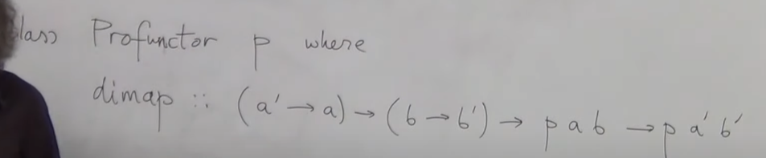

??

## function types

### Funkcja jako obiekt kategorii

normalnie nie mamy jako tkaiego sposobu mówienia o funkcjach jako o obiektach.
Niech funkcja to będzie produkt (a, f) -> b
W ten sposób mamy produkt a i f jako funkcje do b. Kategorie które nie mają produktu nie mają funkji jako obiektów.

### uniwersalna konstrukcja obiektu funkcji

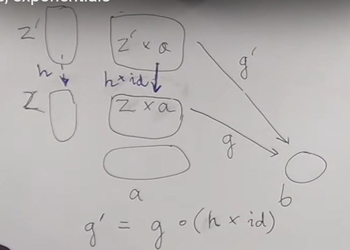  
H X id wynika z teorii o bifunktorach

Ta konstrukcja uniwersalna pozwala myśleć o funkcjach w dwa sposoby. Ponieważ każdy g' ma dokładnie jeden odpowiadający mu h. Przez g' z produktu możemy myśleć o funkcji dwuargumentowej działającej z produktu do wynika. Możemy tez myśleć przez h, o funkcji przyjmującej argument i zwracającej kolejną funkcję. Nazywamy to **currying**

W nazewnictwie CT **function object** == **exponential**

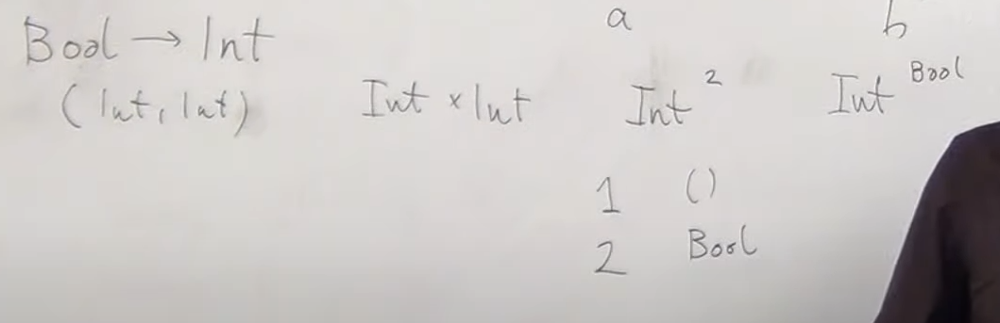

Zwłaszcza przydatne do programowania są kartezjańskie kategorie zamknięte. Oznacza to że są kartezjańskie (produkt dla każdego obiektu) i mają exponential dla kazdego obiektu.
Dodatkowo mają obiekt terminalny (obiekt terminalny to wykładnik zerowy).

### algebra na typach

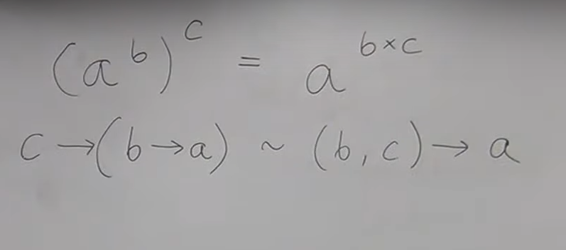
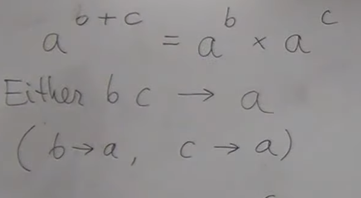  
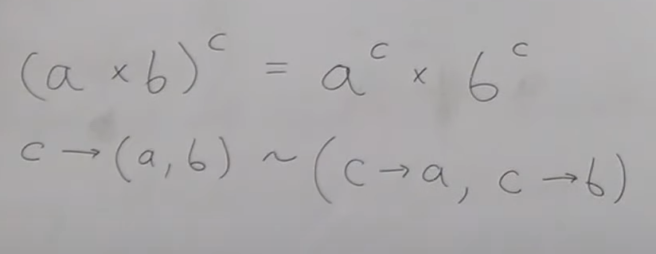

## Curry-Howard-Lambek isomorphism

Typy = wyrazy logiczne
Jeżeli typ jest zamieszkały == true jeżeli nie false

przykład void == false
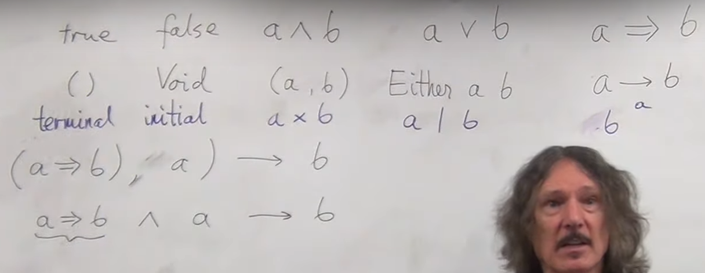

## Natural transformation

Najzważniejsze rzeczy w teorii ketagorii:

- definicja kategorii
- definicja funktora
- definicja naturalnej transformacji

Potrzebujemy sposobu na mapowanie funktorów by je porównywać.

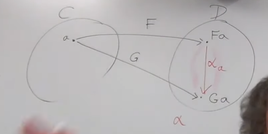  
mając dwa funktory F i G potrzebujemy sposobu mapowania między nimi czyli Fa -> Ga.
Ponieważ jest Fa i Fg są w tej samej kategroii szukamy jednego z morfizmów między tymi obiektami.

- (Co jeżeli nie istnieje morfizm?)
- (jak wybieramy morfizmy?)

Musimy zmapować również morfizmy między obiektami w C.
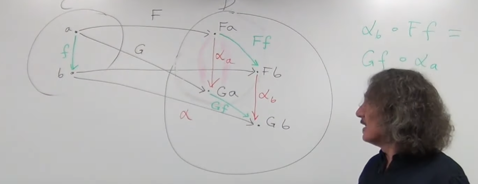  
Na prawej równanie nazywa się naturality condition

Intuicja dla naturality condition:
Zobaczmy dla set cat co się dzieje z elementami:
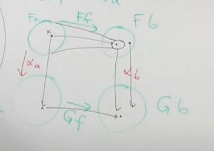

Jeżeli Ff i alfa a byłyby izomorfizmami wtedy alfa b byłby ustalone z góry.
Generlanie obietky musza się schodzić według strzałek, jedyna elastyczność dla alfa b jest w kontrakcji.

Inaczej mówi sie że naturalna transformacja mapuje obiekt do morfizmu tutaj a do alpha a.

- (commuting diagrams?) - diagram tutaj ze idziesz gora i dolem to samo!

Czyli tak samo można zamiast mówić że diagram jest commuting można po prostu powiedzieć że istneije naturalna transformacja

Przy naturalnej transformacje morfizmy gubią dane.
Znaczy to że jeden z funktorów jest niższej rozdzielczosc - gubi dane. Znaczy to że nie możemy odwrócic morfizmów

Istnieją jednak izomorficzne naturalne transformacje które posiadają odwrotny morfizm .

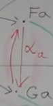

Jezeli zdefiniuje funkcje alpha w ten sposób

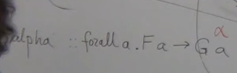

naturality condition dostaje za darmo. Typ tutaj pociąga naturalność

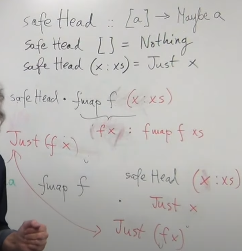  
Kompilator moze zrobic optymalizacja dla kazdej naturalnej transformacji.
przez to że strony można zamieniać możemy liftowac funkcje i pozniej aplikowac zamist w druga strone co wymagaloby przejscia przez wszystkie elementy.

Intuicja
naturalna transformacja nigdy nie zmienia wartosci w kontenerze
zmienia natomiast ksztalt kontenera

Duzo polimorficznych funkcje jest naturalnymi transformacjami. Generalnie gdy mapujemy jeden kontener na inny.
